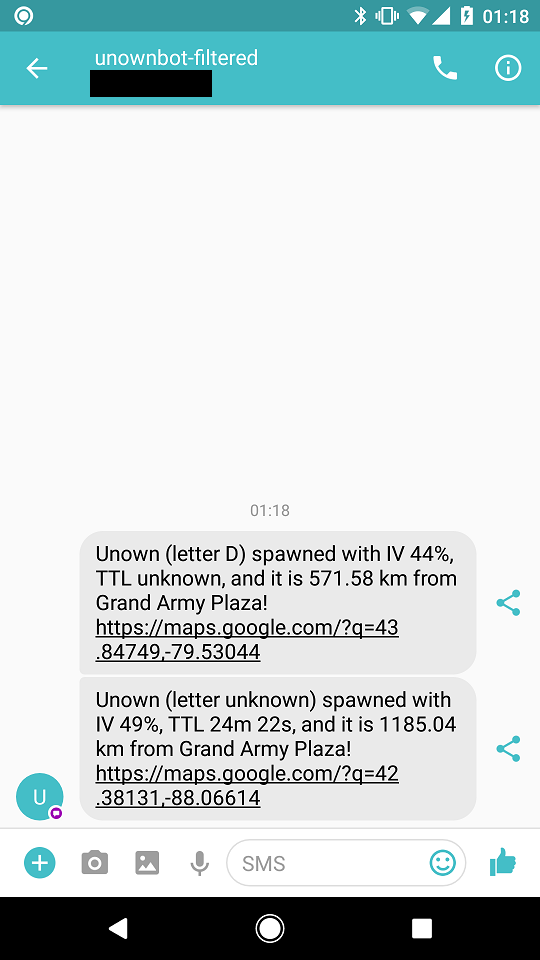

# @nycpokespawn, filtered

This program is designed to give you a filtered view of the [@nycpokespawn](https://twitter.com/nycpokespawn) Twitter account. It **filters by Pokémon** (so you can avoid getting notified about ones you already have) **and by distance to a set of locations** (so you can be notified only about Pokémon that spawn near locations you usually hang out at).



## Setup

### Getting the code

This program is written in [Node.js](https://nodejs.org/), which you'll need to install on your computer. If you already have Node.js installed, make sure it is at least v6.5.0; if not, update.

Once you have Node.js installed, you'll need to open a terminal ([Mac documentation](http://blog.teamtreehouse.com/introduction-to-the-mac-os-x-command-line), [Windows documentation](http://www.howtogeek.com/235101/10-ways-to-open-the-command-prompt-in-windows-10/)). Then install the program by typing

```
npm install -g nycpokespawn-filtered
```

This will take a while as it downloads this program from the internet. Once it's done, try to run it, by typing:

```
nycpokespawn-filtered
```

This will error, telling you that you need to set up the config file. Follow those instructions, using the below section for guidance. Once you've done all that, you can type `nycpokespawn-filtered` in the console again, and this time it should work!

### Configuring the program

- Copy `config.sample.json` to `config.json`.
- Add your Twitter API credentials:
  - [Generate a Twitter token](https://dev.twitter.com/oauth/overview/application-owner-access-tokens) for your account.
  - You'll probably need to create a new application while doing so.
  - Use the generated data to fill in the appropriate fields in `config.json`.
- Add your Twilio API credentials:
  - [Sign up for an account](https://www.twilio.com/try-twilio)
  - Use the resulting page to fill in the appropriate fields in `config.json`.
  - Go to the SMS section and click "Get your first Twilio number", and fill that field in as well.
  - FYI, if you don't pay Twilio, it will prepend "Sent from your Twilio trial account - " to all your messages.
- Set the phone number to text in `config.json`'s `numberToText` field.
- Update the locations with whatever locations and radiuses you want to monitor. Radiuses are in kilometers.
  - [According to Wikipedia](https://en.wikipedia.org/wiki/Preferred_walking_speed), average human walking speed is 5.0 km/h with fast walking "upwards of" 9.0 km/h.
  - So let's say you run at 12 km/h since you're really motivated to catch Pokémon. That's 0.2 km/min.
  - Maybe you'll get 15 minutes warning in the best case, so a conservative radius that shouldn't miss many pokes is 3 km.
- Pare down the list of Pokémon you want to search for based on your Pokédex.
  - Note that @nycpokespawn does not Tweet all the Pokémon 😕. So some of the Pokémon in the list will likely never matter.

## Testing

You can test the program after installing it by running

```
nycpokespawn-filtered-test
```

which will use the test data stored in this repository's `test/fixtures/tweets.json` file to run through the normal program, log what's going on, and text you if appropriate. This can be used to ensure you did the setup correctly.

## Running

Once setup is complete, do

```
nycpokespawn-filtered
```

to start the program. It will run forever, logging output for your information, and texting when appropriate.

You could leave this running on your computer, if it doesn't turn off often, or maybe you could get a cloud provider. I haven't looked into that yet, but [now](https://zeit.co/now/) is really nice and easy to use, although you have to pay to keep things secret (like your API credentials).

## Running multiple instances

If you want to run multiple instances (e.g., set up one for you and another for your friends), you can use multiple config files.

To do that, copy `config.sample.json` to multiple files, e.g. `config-alice.json` and `config-bob.json`, and fill it out differently for each person. (You can share API credentials between configs, although you might get rate limited if you share them too much.) You will want to change the `configLabel` field with some identifying value (e.g. their name).

Once you have the configs set up, run the program passing each config file. For example, to run an instance for Alice, do

```
nycpokespawn-filtered config-alice.json
```

## Running as a web server (experimental)

If you've cloned the source repository, you can do

```
npm run start
```

to start a server which will act the same as the daemon, but visiting it will display the log file. This is helpful if deploying somewhere (like now.sh) which demands that you run a HTTP server.

## Future possibilities

- If you have overlapping zones, only text about one of them
- Add walking or cab times to the messages
- Add a simple web UI that would allow you to update the locations list on the go (so e.g. if you're spending a day in Central Park you can add it from your phone)
- Re-do the project to be based on direct Pokémon Go API access, using hundreds of accounts spread throughout the city, instead of using the @nycpokespawn Twitter stream
  - This would allow us to get notified about Pokémon that @nycpokespawn doesn't care about, such as Lickitung or Magmar
  - [This Node.js chatbot code](https://github.com/hlfshell/pokemon-go-slackbot/blob/master/chatbot.js) looks fairly simple
  - And with [PTC-Creator](https://www.npmjs.com/package/PTC-Creator) we can create hundreds of accounts fairly easily
